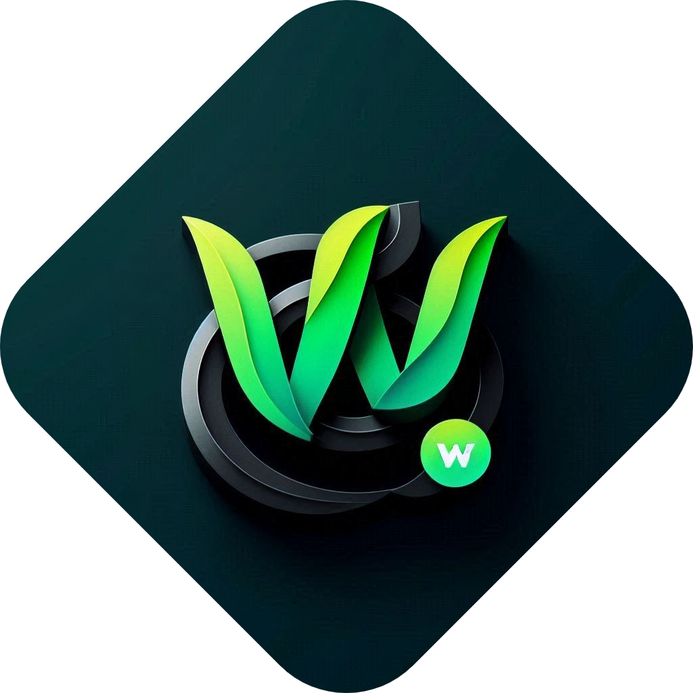

  

<h1 align="center">WattDownload</h1>

  Freedom to read - guaranteed

---

  

---
## Vision
 - Make EDU hassle free with Sipsuru Platform

## Mission
 - To Endow the Society with a Person Who Works With a Clear Mind & Relaxed Mind, but With Ultimate Knowledge Through Making the Learning Process Easier.

## Disclaimer

## How Legal?

## Not Legal?

## Current Available Features (Windows, Linux, MacOS Only)
 - Sipsuru-Web to open courses from Sipsuru with Patched Sipsuru App (Allows you to run Official Apps alongside with Patched ones.)
   
   

 - New Improved GUI - Dark Mode, Background Images, Colorizations.

   

 - Screenshot & Record restrictions are removed.
 - User Watermark Removed (Animated Watermark removed - from Player)
 - User Tracking Removed. (They don't know what you do.)
 - Database Integration Removed. (They don't know what you do, which device you use, when you opened the course, etc.)
 - Unlimited Watch Time with addon `Sipsuru Share Reveice`. (Instead of 10hrs watch time, now you can watch them unlimited till they remove the video from AWS servers, typically after 3 months from uploading.)
 - No One Device Restriction. (One device restriction removed, now you can watch the same course in your mobile, tab, tv, desktop, laptop etc, (even at the same time))
 - Addon: Share Receive (Can backup and share all courses just as a token or cloud links file, which are custom text files, that consumes about 1MB of your storage, they're valid till the video is removed from AWS servers typically after 3 months from uploading.)
 - Addon: Poster Customizer (Can customize background images of Sipsuru Media Player. Can add any of your own image.)
 - Addon: Media Downloader (Can download courses from Sipsuru Media Player or backups (token or link files), to local computer as mp4 files, directly from AWS server, without any watermark.)
 - Seamless Integration (The patched software and addons integrate with each other seamlesly to provide the best of the best.)

## Current Available Features (Android Only)
 - Screenshot & Record restrictions removed.
 - 

---

> [!NOTE]
> `Sipsuru`, `Yomboc`, `Siyapatha`, `Sipsuru Logo`, `Sipsuru YT Banner` all subject to registered tredmarks of `Sipsuru`, `Siyapatha` & `Yomboc`.

> [!NOTE]
> No legal actions against repository auther/owner (by copyright owners or tredmark owners or any other party) is applicable since all the patched software (including all versions) are licensed under ***CC0-1.0 LICENSE*** which specially allows to do any modifications: [Verify Legality](https://creativecommons.org/publicdomain/zero/1.0/)
> And the repository owber has all the evidences to prove that the software are licensed under CC0-1.0 License.

> [!NOTE]
> On Patching Android: It's not commonly claimed as a crime to patch an android app, plus only screenshot-record restrictions removed. So, no lawsuites are filable just like in desktop patch.

> [!TIP]
> We're not publicly providing the patched applications since there maybe a abusive use of the patched app. (Especially for illegal matters), so you can contact me with: yt2.dev.dragon@gmail.com to request the software.
> Note that you'll need to prove that you're a student to aqquire valid license to run Patched software.

© 2025 Sipsuru Patch. All rights for the patch are reserved.

